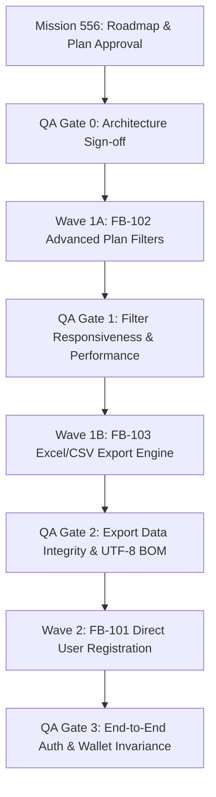

# Mission 556 — Approved Backlog Execution Roadmap & Technical Plan

**Mission Status**: ACTIVE 🟢  
**Approved Baseline**: `v2.4.6-client-premium-demo-approved` (FROZEN ❄️)  
**Scope**: Pure Architectural Planning & Roadmapping (Code Changes = 0, DB Migrations = 0, Production Changes = 0).

---

## 1. Executive Summary & Objective
Mission 556 defines the formal engineering blueprints, user journeys, data contracts, and QA gates for the three approved Phase 4 features:
1. **FB-101**: Direct User Self-Registration (`/auth/register`)
2. **FB-102**: Advanced Plan Filters (`/admin/plans`, `/user/plans`)
3. **FB-103**: Excel/CSV Data Export Engine (`/admin/users`, `/admin/doctors`)

---

## 2. FB-101 — Direct User Registration Specification

### 2.1 User Journey & UI Flow
1. User visits `/auth/login` and clicks on "ایجاد حساب کاربری جدید".
2. Navigates to `/register/user` (or inline switch).
3. Inputs mobile number $\to$ receives OTP.
4. Enters 5-digit OTP + full name + national code (optional/required) + desired password.
5. On successful verification:
   - User account is created with `status: ACTIVE`, role: `['USER']`.
   - Default wallet (`Wallet`) initialized with 0 balance.
   - Profile record (`Profile`) created.
   - JWT tokens generated and user automatically logged in $\to$ redirected to `/user/dashboard` (or `/user/plans?ref=...`).

### 2.2 API & Auth Impact
- **New Endpoint**: `POST /api/v1/auth/register`
- **Request Payload**:
  ```json
  {
    "mobile": "09121234567",
    "otpCode": "12345",
    "password": "UserPass@123",
    "firstName": "علی",
    "lastName": "محمدی",
    "nationalCode": "0012345678",
    "referralCode": "HC1234567890"
  }
  ```
- **RBAC**: Public endpoint with strict rate-limiting (max 3 registrations per IP per hour).
- **Security**: Password hashed using `bcrypt` (12 rounds). Zero elevation beyond `USER` role.

### 2.3 Acceptance Criteria
- [ ] User cannot register with an existing mobile number (returns `409 CONFLICT`).
- [ ] OTP must be valid and non-expired.
- [ ] Password must meet minimum complexity (min 6 characters).
- [ ] Auto-login on success with valid JWT access and refresh tokens.

### 2.4 Test Plan & Risk Level
- **Unit/Integration**: Mock OTP verification, schema validation tests.
- **E2E Test**: Complete browser flow from login link to registration to dashboard redirect.
- **Risk Level**: **Medium** (requires live SMS integration in production; mockable in demo).

---

## 3. FB-102 — Advanced Plan Filters Specification

### 3.1 Target Screens & Filter Fields
- **Admin Plans (`/admin/plans`)** & **User Plans (`/user/plans`)**
- **Filter Fields**:
  - Search query (title, description, tags)
  - Price Range: `minPrice` & `maxPrice` (Toman)
  - Discount Range: `minDiscount` & `maxDiscount` (Percentage)
  - Plan Duration / Validity (1 month, 3 months, 6 months, 1 year)
  - Status (Active, Inactive, Archived - Admin only)

### 3.2 Frontend & API Query Design
- **Query Params**:
  `/api/v1/plans?search=دندان&minPrice=100000&maxPrice=1000000&minDiscount=20&maxDiscount=50&status=ACTIVE&page=1&limit=20`
- **Client State**: URL query param synchronization for bookmarkable and shareable filter states.
- **Debouncing**: 300ms debounce on text and numeric slider inputs.

### 3.3 Acceptance Criteria
- [ ] Filtering updates table without full page reload.
- [ ] Reset Filters button restores default view instantly.
- [ ] Works identically across mobile (390px) and desktop (1440px).

### 3.4 Test Plan & Risk Level
- **Performance**: Query response < 100ms with 1,000+ plans.
- **Risk Level**: **Low** (pure frontend filter component + non-breaking query extension).

---

## 4. FB-103 — Excel/CSV Export Engine Specification

### 4.1 Scope & Target Datasets
- **Admin Users (`/admin/users`)**: Full export of filtered user lists (ID, Name, Mobile, Role, Status, Creation Date).
- **Admin Doctors (`/admin/doctors`)**: Full export of doctors & medical centers (Name, Specialty, City, Phone, Contract Status).

### 4.2 Technical Architecture & Format
- **Engine**: Lightweight server-side streaming or client-side generator using `xlsx` / standard CSV stream.
- **Format Options**: `.xlsx` (Excel 2007+) and `.csv` (UTF-8 with BOM for proper Persian character rendering in Windows Excel).
- **Security & RBAC**: Restricted strictly to `SUPER_ADMIN` and `ADMIN` roles. Logged in audit log (`AuditActions.DATA_EXPORT`).
- **Performance Limits**: Maximum 5,000 rows per single export; background worker/chunking for larger sets.

### 4.3 Acceptance Criteria
- [ ] Export button disabled for non-admin roles.
- [ ] Persian text in exported CSV opens without encoding issues in Excel (`\uFEFF` BOM header).
- [ ] Export honors currently applied table filters (exports only filtered rows if filter is active).

### 4.4 Test Plan & Risk Level
- **Integration**: Validate generated buffer integrity and MIME type (`application/vnd.openxmlformats-officedocument.spreadsheetml.sheet`).
- **Risk Level**: **Low** (stateless export utility, zero database mutation).

---

## 5. Dependency & Architectural Impact Matrix

| Feature | Modules & Files Involved | RBAC Impact | Data Layer / DB Impact | Risk Level |
|:---|:---|:---:|:---:|:---:|
| **FB-101** | `src/app/auth/register/*`, `src/app/api/v1/auth/register/*`, `src/stores/auth-store.ts` | Assigns `USER` role | Creates User, Profile, Wallet | **Medium** |
| **FB-102** | `src/app/admin/plans/*`, `src/app/api/v1/plans/*`, `src/components/plans/*` | None (Public/Admin) | Read-only query filter | **Low** |
| **FB-103** | `src/lib/export.ts`, `src/app/admin/users/*`, `src/app/admin/doctors/*` | Requires `ADMIN` | Read-only with Audit log | **Low** |

### Database Migration Policy:
- **Zero Migrations in Mission 556**: Schema already supports User, Profile, Wallet, and Plan fields.
- No DDL statements or migrations will be run.

---

## 6. Execution Sequence & QA Gates



### Proposed Sequence:
1. **Stage 1 (Wave 1A - Lowest Risk)**: Implement **FB-102** (Plan Filters).
2. **Stage 2 (Wave 1B - Low Risk)**: Implement **FB-103** (Excel/CSV Export).
3. **Stage 3 (Wave 2 - Core Auth Expansion)**: Implement **FB-101** (Self-Registration).

---

## 7. Rollback Strategies
- Each feature branch branched strictly off frozen release tag `v2.4.6-client-premium-demo-approved`.
- If any stage fails QA gates, isolated rollback via `git revert` or container restart without impacting production or demo baseline.
